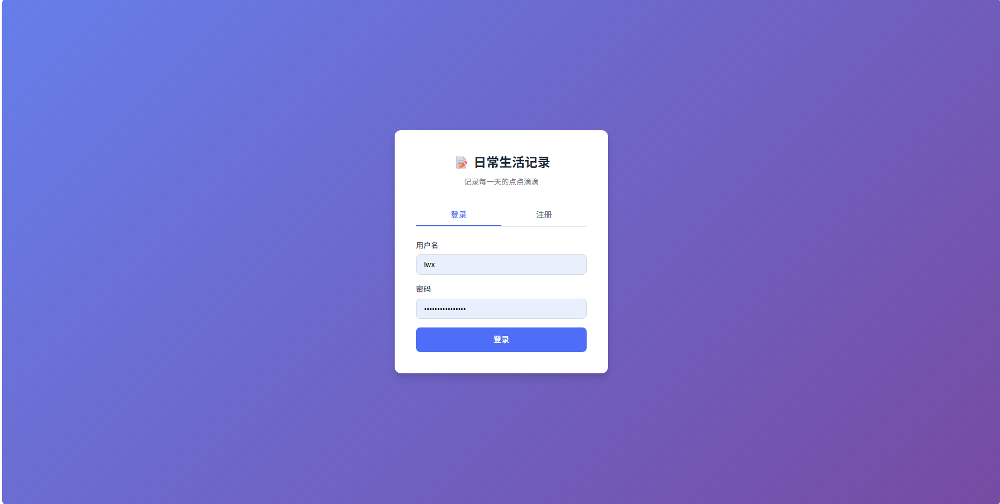
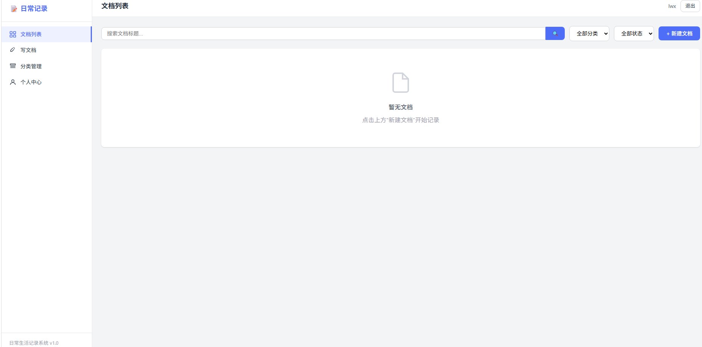

# SelfProject_2.1.0
这是一个前后端分离项目
日常生活记录系统是一套轻量化的文档管理工具，满足个人/小团队日常文档、笔记、待办、生活记录的 管理需求，支持文档的增删改查、分类管理、数据持久化存储。
 前端
- HTML5 + CSS3 + JavaScript（Vue 3 + Vue Router 4，CDN 引入）
- 部署于 Nginx
   后端
- Java 17 + SpringBoot 2.7.18
- MyBatis-Plus 3.5.3.1（ORM 框架）
- JWT（jjwt 0.11.5，身份验证）
- Maven 3.9.9（项目构建）
- Redis（内存缓冲）
 数据库
- MySQL 8.0+（生产环境）
- H2 Database（开发环境，可选）
  ## 项目预览

  
    
  

